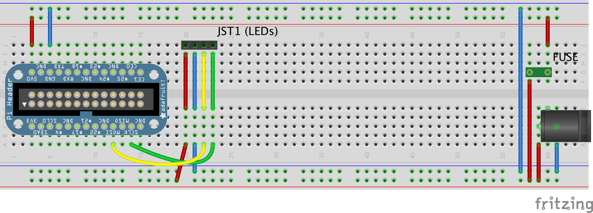

# Raspberry Pi Lighting 
Inspired by [@Rasathus's Nasa Style Circadian Lighting](http://rasathus.blogspot.co.uk/2013/01/circadian-lighting-part-one.html)

## Phase 1
Just wire up the basics and get @Rasathus's code working.

## Parts List
* [Raspberry Pi Model B](https://www.adafruit.com/products/998)<sup>1</sup>
* [Pi Cobbler Breakout + Cable](https://www.adafruit.com/products/914)
* [5V 4A switching power supply ](https://www.adafruit.com/products/1466)
* [2.1mm DC barrel jack](https://www.adafruit.com/products/914)
* [12mm Diffused Flat Digital RGB LED Pixels](https://www.adafruit.com/products/738)
* [4-pin JST SM Plug + Receptacle Cable Set](https://www.adafruit.com/products/578)
* [Miniature WiFi (802.11b/g/n)](https://www.adafruit.com/products/814)<sup>2</sup>
* Breadboard, jumpers, etc.


<sup>1</sup> This is the original Pi model B, not the Pi 2 or the Pi B+.  This should work with any version of the Pi, but you will need the correct Cobler.  And you may need to adjust some of the GPIO pins.

<sup>2</sup> I'm actually using a different wifi adapter I bought a while back.  I also have the one I listed, and adafruit has good instructions.

## Wiring
### Components
* The left most item represents the Raspberry Pi Cobler
* JST1 is what connects to the LED's.  The wires below it match the colors of the LED strand.
* The little green component to the right represents a resettable fuse
* The black component on the right is the power connector

### Connections
* +5v PWR —> lower red rail
* +5v PWR -> fuse
* fuse -> upper red rail
* ground -> lower blue rail
* lower blue rail -> upper blue rail


* Pi 23 - SLCK —> LED 4 green - serial clock
* Pi 19 - MOSI —> LED 3 yellow - serial data
* ~~Pi 02 - 5v —> fused power (upper red rail)~~ 
* Pi 06 - GND —> GND


* LED 1 red -> unfused power (lower red rail)
* LED 2 blue -> ground (either blue rail)

Note that the Pi to Fused Power (+5v) is marked out.  This should work but didn't.  I'm powering the Pi via USB for now.



## Code
1. Install Dependencies (from some other directory)
```
pip install Flask
pip install apscheduler==2.1.2
git clone https://github.com/rasathus/pigredients.git
cd pigredients/
sudo python setup.py install
```

2. The `src` folder contains @Rasathus's code. `app.py` has a few minor tweaks:
    * `circadian.conf` is read from the current directory
    * Commented out the log to file code

3. Run `python app.py`
4. Browse to your Raspberry Pi on port 8090